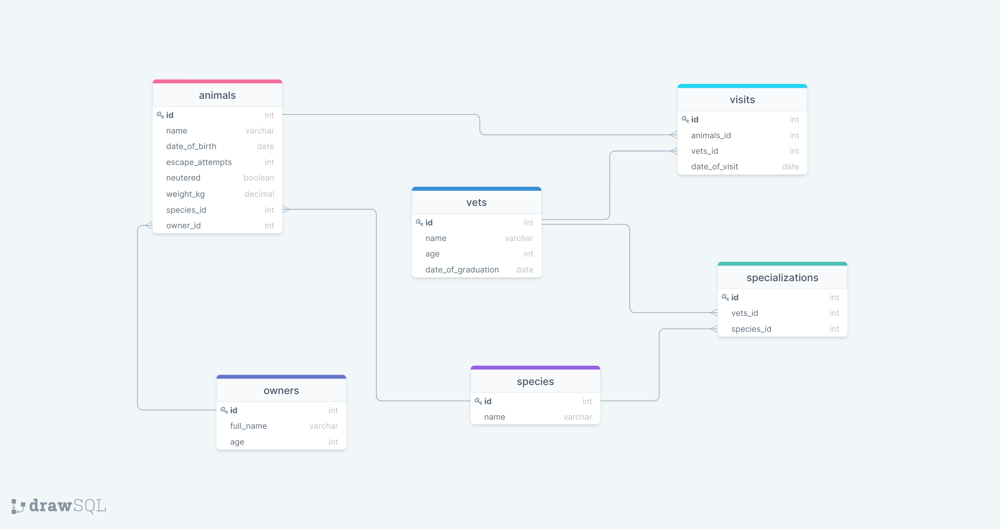

# VET CLINIC DATABASE

> This project contains a relational database to create the data structure for a vet clinic. It is still being worked on. However, at the end of the project, a complete database with data about `animals`, `animal owners`, `clinic employees`, and `visits` would have been created.

## Getting Started

This repository includes files with plain SQL that can be used to recreate a database:

- Check [schema.sql](./schema.sql) to see data used to create all tables.
- Check [data.sql](./data.sql) to see data used to populate tables with clinic information.
- Check [queries.sql](./queries.sql) for queries that were made to the database. **Important note: this file might include queries that make changes in the database (e.g., remove records). Use them responsibly!**

# 👤 Author

GitHub: [@dammyShittu](https://github.com/DammyShittu/)

Twitter: [@aded_shittu](https://twitter.com/aded_shittu/)

LinkedIn: [Adedamola Shittu](https://www.linkedin.com/in/adedamolashittu/)
## 🤝 Contributing

Contributions, issues, and feature requests are welcome!

Feel free to check the [issues page](https://github.com/DammyShittu/Vet-Clinic-Database/issues).

## Show your support

Give a ⭐️ if you like this project!

## Acknowledgments

Many thanks to Microverse for providing the tamplate that was used for this project.

## 📝 License

This project is [MIT](LICENSE) licensed.
